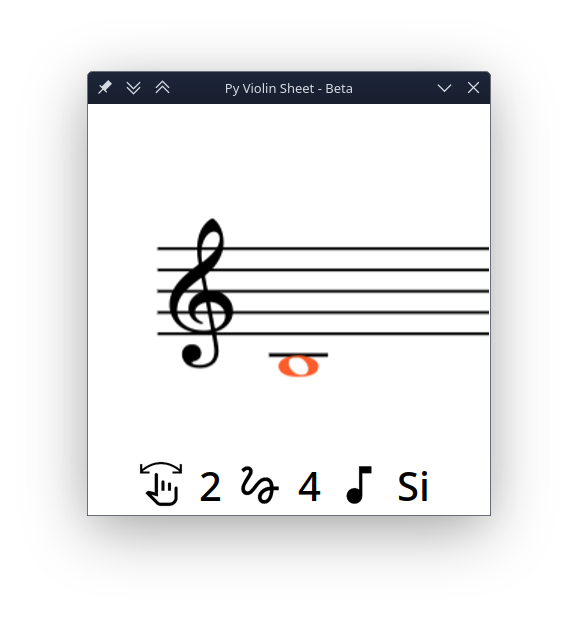

# Welcome to PyViolinSheet!

PyViolinSheet is a simple and lightweight personal project designed to help learn violin notes. Because it is designed to be simple and easy to use, you can also run it on your mobile device using appropriate interpreters.

The software is written in Python, using Tkinter for the graphical user interface and Pillow for image processing. PyViolinSheet graphically displays violin music notes, showing below each note its name and the string number on which it should be played.

The note names correspond to the filenames of the images shown, which are stored in the Images folder. By default, you have four seconds to play the displayed note.

PyViolinSheet aims to provide a straightforward and practical tool for practicing note recognition and violin string positioning in an interactive learning environment.

>This is a personal project and the developer does not intend to add advanced or complex patches to it and tries to develop this software under the Unix philosophy.




# How to use ?


Running the software is very simple and requires no installation. You only need to install the following libraries for your **Python3** interpreter:

-   **tkinter**

To install it on Linux operating systems, you must use your distribution's package manager. 
Here we show how to install it for a number of popular Linux distributions.

   Fedora Linux : 
   ```bash
sudo dnf install python3-tkinter
```
Ubuntu/Debian Linux :
```bash
sudo apt-get install python3-tk 
```


-   **pillow**

To install Pillow, you just need to use pip.
```bash
python3 -m pip install Pillow
```

Then, download the source code of the software, open your terminal in the same directory as the `main.py` file, and run the following command:
```bash
python3 main.py
```

# How can you help the project or me?
Simply clone the project and enhance it by adding advanced features. Or, just give me a star! You can also simply download and use the project, which would make me very happy.

*Mehdi Hosseini Asad*


---
**This project is licensed under the GNU General Public License (GPL) version 3. See the LICENSE file for details.**


